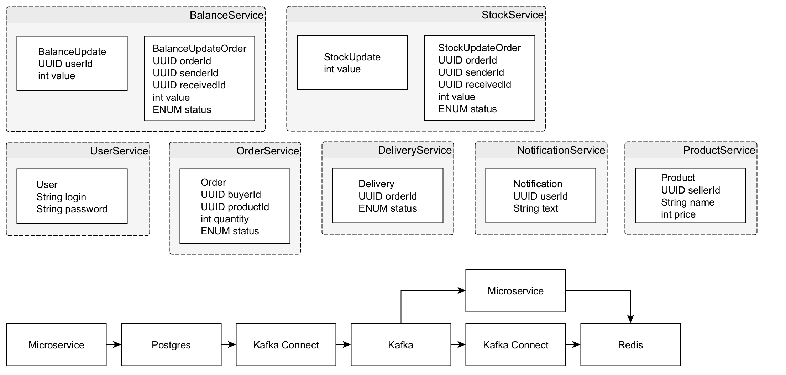
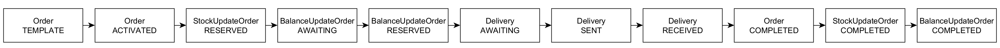
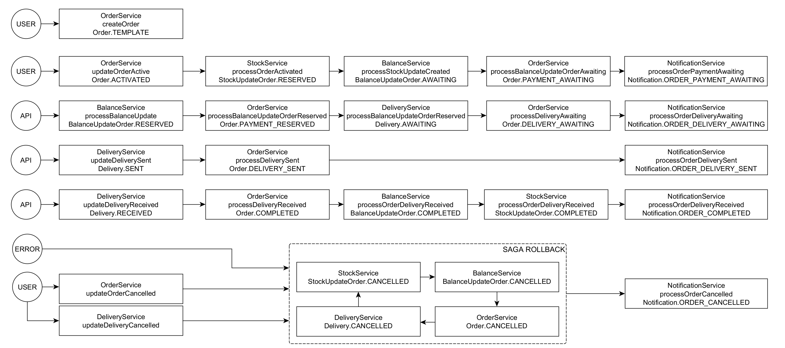

## Веб-приложение для размещения объявлений о продаже товаров

### Используемые паттерны
✔️ Microservices 
✔️ HighLoad 
✔️ Event-Driven 
✔️ Choreographed Saga 

### Используемые технологии
✔️ Spring Boot (MVC, AOP, JPA, Security, Cache, Kafka) 
✔️ PostgreSQL, Redis 
✔️ Kafka, Kafka Connect 
✔️ Docker Compose, Kubernetes, Helm 
✔️ Loki, Jaeger, Prometheus, Grafana 

### Функционал
✔️ Регистрация пользователя (userservice) 
✔️ Регистрация товаров для продажи (productservice) 
✔️ Учет запаса товаров (stockservice) 
✔️ Создание заказа (orderservice) 
✔️ Снятие/передача/пополнение денег (balanceservice) 
✔️ Учет и обновление статуса доставки товара (deliveryservice) 
✔️ Отправка уведомлений пользователям (notificationservice) 

### Основная Saga
1) Пользователь создаёт заказ (orderservice)
2) Товар резервируется (stockservice)
3) Ожидается пополнение счета заказчика (balanceservice)
4) После пополнения деньги резервируются (balanceservice)
5) Ожидается отправка товара продавцом (deliveryservice)
6) Ожидается получение товара покупателем (deliveryservice)
7) Деньги переводятся продавцу, уменьшение запаса товара фиксируется

### Способы запуска
* docker/compose.yaml
* kubernetes/install.sh

### Схема
#### Сервисы

#### Упрощённая саги

#### Полная саги
